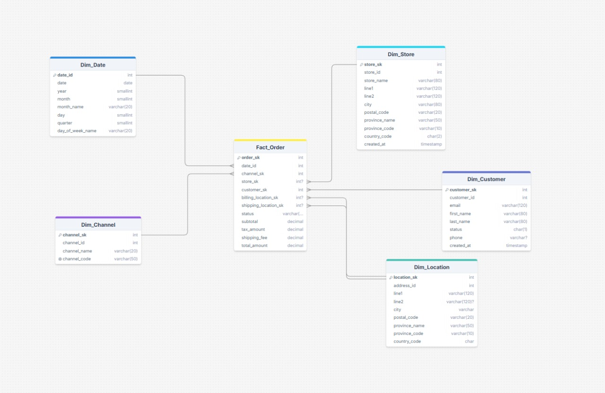
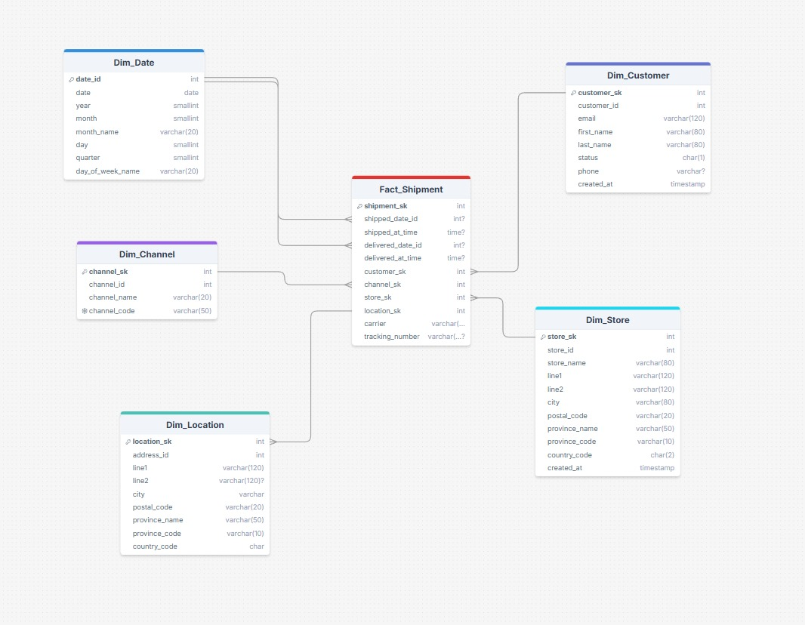
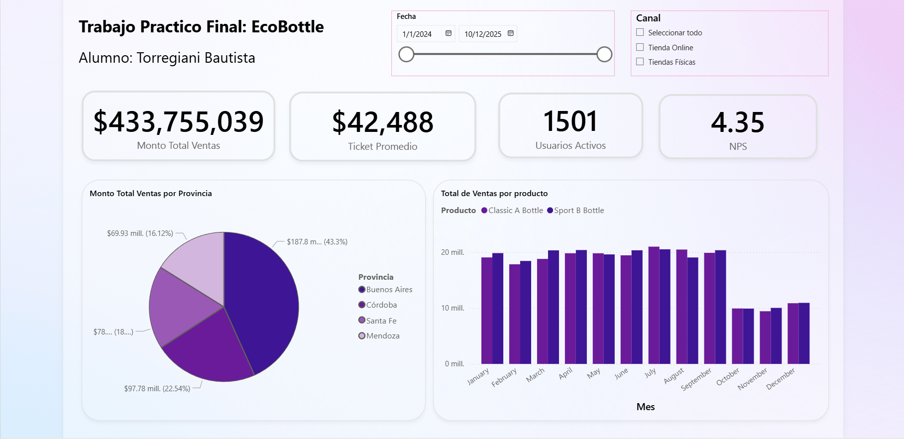

# Introducción al Marketing Online y los Negocios Digitales - TP Final

##  EcoBottle - Desnormalización y Creación de Dashboard

## 1. Introducción y Objetivos

El objetivo principal de este proyecto es **diseñar e implementar un mini-ecosistema de datos comercial  y construir un dashboard** que sirva como reporte para un área comercial.

La metodología implementada es el **modelado dimensional (esquema estrella) de Kimball**, asegurando que el modelo de datos esté optimizado para consultas analíticas y reportes.

## 2 Flujo de Datos (ETL)
1.  **Extracción (Extract):** Lee los archivos `.csv` desde el directorio `raw/`.

3.  **Carga (Load):** Guarda los DataFrames transformados como nuevos archivos `.csv` en el directorio `dw/`.


## 3. Modelo de Datos (Esquema Estrella)
El modelo de datos se descompone 6 esquemas estrella, uno por cada proceso de negocio.

### 3.1. Fact_Order



### 3.2. Fact_Order_Item


### 3.3. Fact_Shipment



### 3.4. Fact_Nps_Response


### 3.5. Fact_Web_Session


### 3.6. Fact_Payment


## 📊 Dashboard en Power BI

El dashboard interactivo con todos los KPIs del proyecto se puede consultar en el siguiente enlace:

**[Acceso al Dashboard](https://app.powerbi.com/groups/b750b959-b95e-476b-9a28-42cc455b124d/reports/50382176-c6dc-411c-a5b6-d86b6c34b489/1340d953aaf8568da55a?experience=power-bi)**




## ⚙️ Instrucciones de Ejecución
Se deben de seguir estos pasos para replicar el entorno y procesar los datos.

1.  **Clonar el repositorio:**
    ```bash
    git clone [https://github.com/BautistaTorregiani/mkt_tp_final.git](https://github.com/BautistaTorregiani/mkt_tp_final.git)
    cd mkt_tp_final
    ```

2.  **Crear y activar el entorno virtual**:
    ```bash
    # En Windows
    python -m venv venv
    .\venv\Scripts\activate
    
    # En macOS/Linux
    python3 -m venv venv
    source venv/bin/activate
    ```

    3.  **Instalar dependencias:**
    El archivo `requirements.txt` contiene todas las librerías de Python necesarias.
    ```bash
    pip install -r requirements.txt
    ```

    4. Ejecución del Proceso ETL

    El script `main.py` actúa como orquestador central y maneja todo el proceso ETL. Este script se encarga de ejecutar las transformaciones en el orden correct para asegurar la integridad.

    Para ejecutar el pipeline completo, se debe ejecutar:

    ```bash
    python main.py